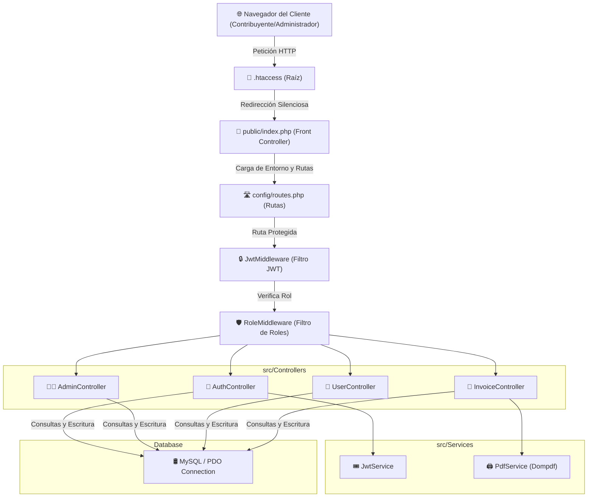
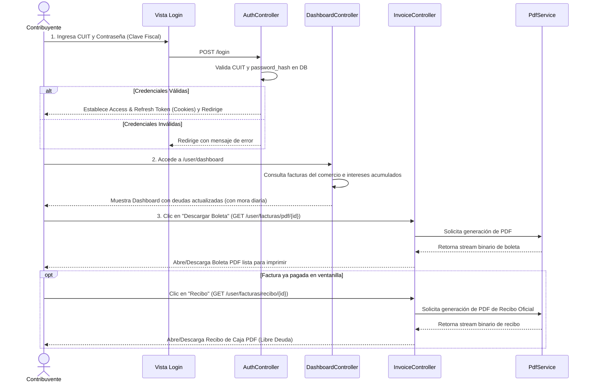
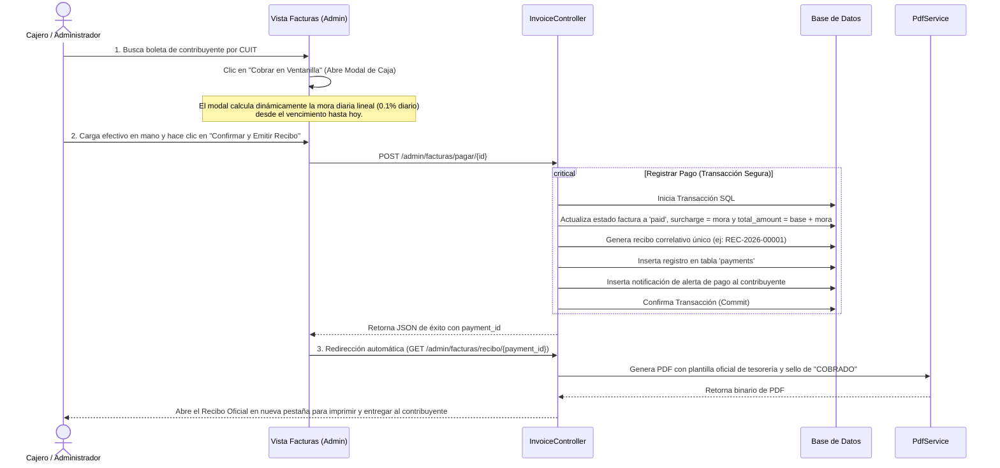
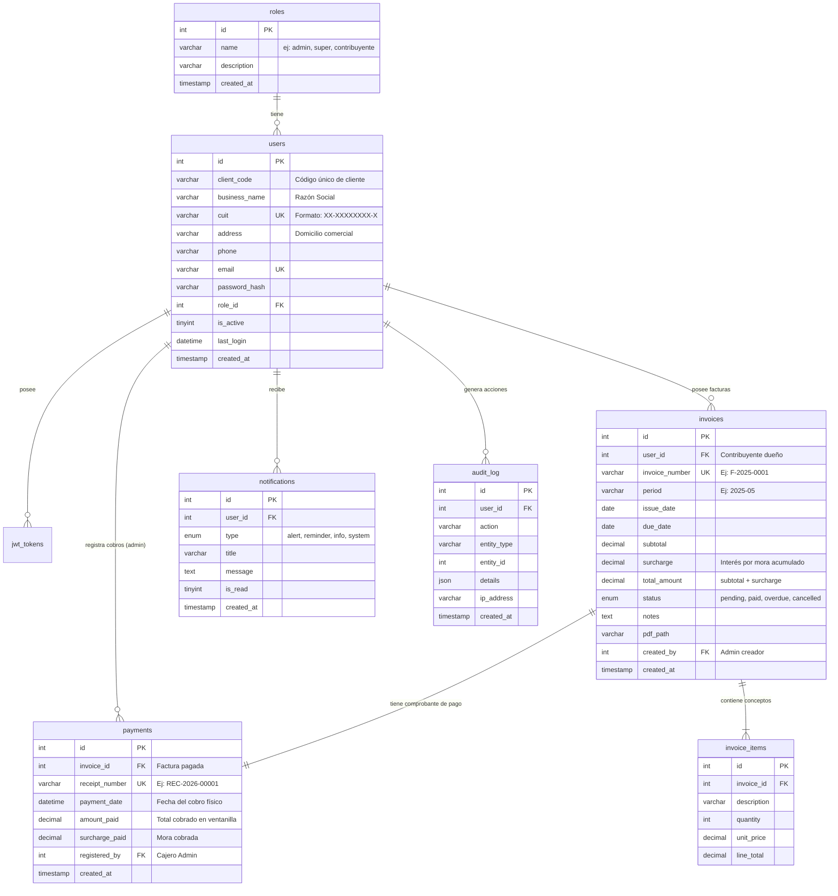

# 🏛️ Mapa Conceptual y Flujo del Sistema de Control Tributario Municipal
Este documento detalla el flujo de navegación, la arquitectura de la aplicación, el modelo de datos y los flujos operativos de la plataforma de control tributario (Tasas de Seguridad e Higiene) para el **Municipio de El Pingo**.

---

## 🧭 1. Arquitectura General y Estructura
El sistema está diseñado bajo el patrón **MVC (Modelo-Vista-Controlador)** de manera simplificada sobre el micro-framework **Slim PHP (v4)**.

---

## 👥 2. Flujos del Sistema por Rol

### A. Flujo del Contribuyente (Consulta y Descarga)
El contribuyente comercial tiene un flujo de **lectura y autoconsulta**. No ingresa pagos directamente de manera online (se abona presencialmente en ventanilla).

---

## 💼 B. Flujo del Administrador / Cajero (Cobranza y Gestión)
El administrador del Municipio (cajero de rentas) controla la facturación, registra pagos físicos en efectivo en ventanilla y administra los comercios.

---

## 🗄️ 3. Modelo de Datos (Base de Datos)
El siguiente diagrama detalla la estructura física de la base de datos `tasas_municipales` y la relación entre sus entidades impositivas.

---

## 📈 4. Regla de Negocio de Recargos por Mora
1. **Detección de Atraso:** Se evalúa la cantidad de días corridos transcurridos desde `due_date` (Fecha de Vencimiento) hasta `fecha_actual`.
2. **Cálculo impositivo:** Si la fecha actual supera el vencimiento, se aplica una tasa lineal del **0.1% diario** (que equivale al **3% mensual** de recargo).
   $$\text{Mora} = \text{Subtotal} \times (\text{Días de Atraso} \times 0.001)$$
3. **Consolidación en Caja:** El interés acumulado se congela e inscribe en la base de datos únicamente al momento en el que el cajero presiona "Confirmar Cobro" en la ventanilla.
